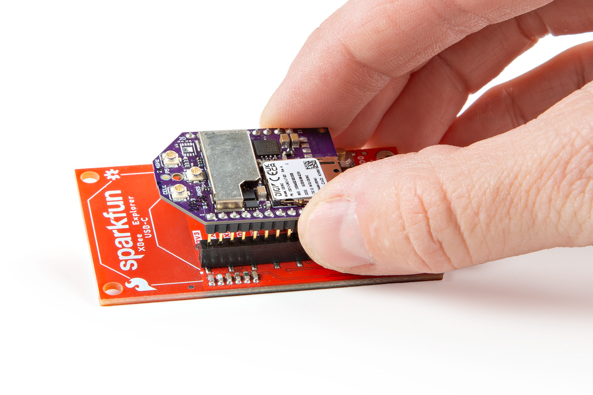

Note the white silkscreen on the Shield PCB - this will help orient your Digi XBee as you're plugging it in. Make sure to match up the Digi XBee's two diagonal edges with the two diagonal lines on the PCB.

<figure markdown>
[{ width="400" }](assets/img/22043-XBeeExplorer-USB-C-Action1.jpg "Click to enlarge")
<figcaption markdown>Digi XBee unit being plugged into the SparkFun Digi XBee® Explorer USB-C</figcaption>
</figure>
