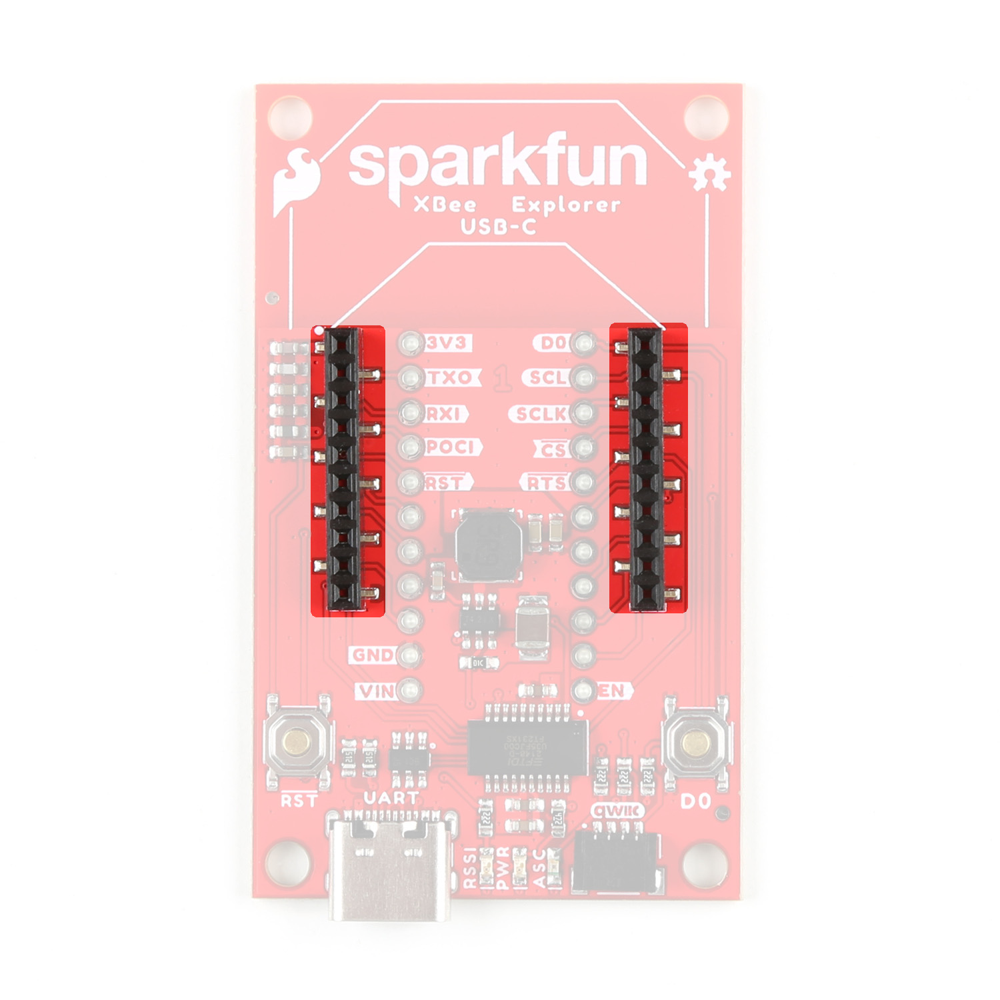
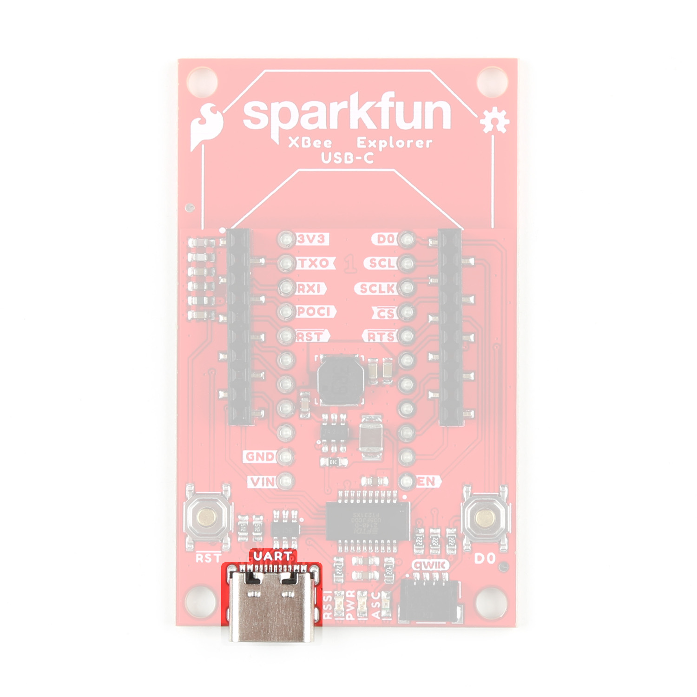
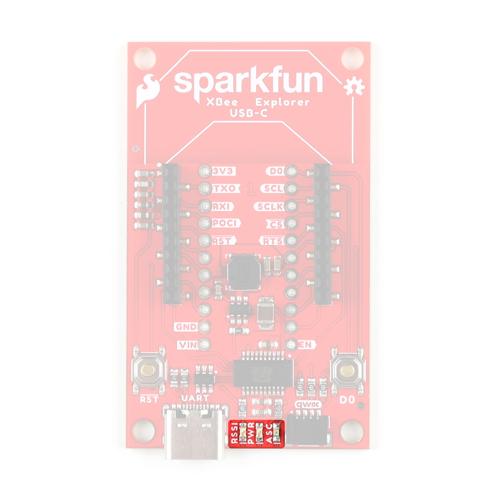
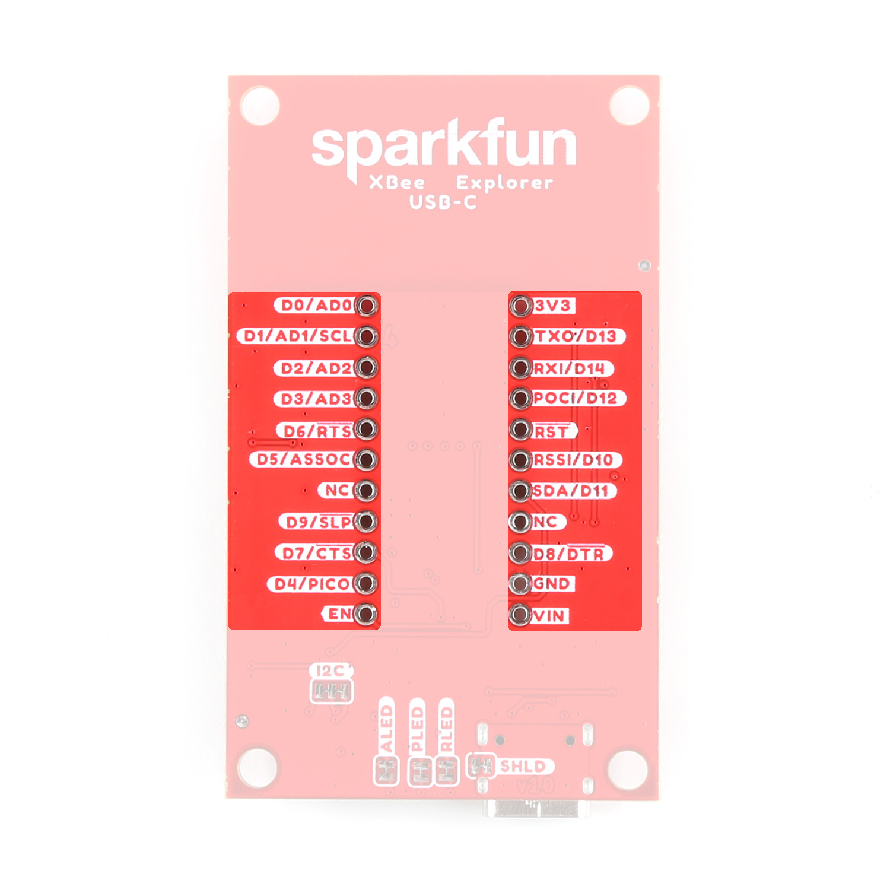
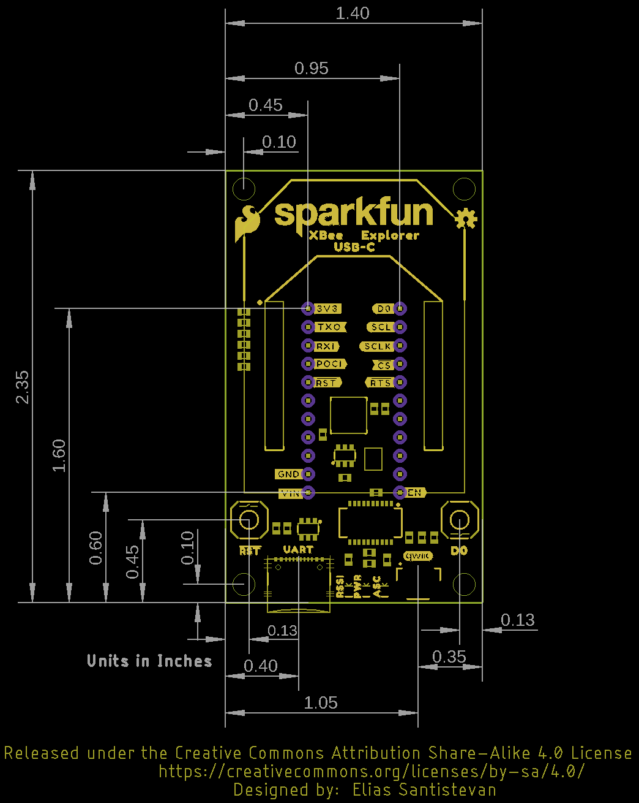

<!-- This section goes into detail about the various components on the product, solder jumpers as well as the board dimensions with a dimensional drawing exported from Eagle. -->

### XBee Smart Modem Socket

We've kept the XBee socket consistent with the XBee pinout, so this breakout board is backwards compatible. In order to take full advantage of this board, we recommend one of the newer Digi XBee boards. Either the [Digi XBee 3 Low-Power LTE-M/NB-IoT, GNSS, no SIM](https://www.sparkfun.com/products/22329) or the [Digi XBee 3 North America LTE Cat 1, 3G, GNSS, no SIM](https://www.sparkfun.com/products/22330). 

<figure markdown>
[{ width="400" }](assets/imgs/assets/img/22043-XBee-Explorer-USB-C-XBeeSocket.jpg "Click to enlarge")
<figcaption markdown>XBeeSocket</figcaption>
</figure>

### Power

The USB-C connector on the board is for UART. Input VCC range is between <b>3.3V-4.3V</b>. 

<figure markdown>
[{ width="400" }](assets/img/22043-XBee-Explorer-USB-C-USBC.jpg "Click to enlarge")
<figcaption markdown>USB-C</figcaption>
</figure>

### LEDs

<figure markdown>
[{ width="400" }](assets/img/22043-XBee-Explorer-USB-C-LEDS.jpg "Click to enlarge")
<figcaption markdown>LEDs</figcaption>
</figure>

### GPIO

We've broken out the XBee pins to plated through holes on either side of the board. 

<figure markdown>
[{ width="400" }](assets/img/22043-XBee-Explorer-USB-C-GPIO-PTHs.jpg "Click to enlarge")
<figcaption markdown>GPIO</figcaption>
</figure>

### Jumpers

??? note "Never modified a jumper before?"
	Check out our <a href="https://learn.sparkfun.com/tutorials/664">Jumper Pads and PCB Traces tutorial</a> for a quick introduction!
	

		<a href="https://learn.sparkfun.com/tutorials/664">
		 
        How to Work with Jumper Pads and PCB Traces</a>
	

### Board Dimensions

The board dimensions are illustrated in the drawing below; the listed measurements are in inches.

<figure markdown>
[{ width="400" }](assets/board_files/SparkFun_XBee_Explorer_USB-C_BoardDimensions.png "Click to enlarge")
<figcaption markdown> Board Dimensions</figcaption>
</figure>

??? tip "Need more measurements?"
	For more information about the board's dimensions, users can download the [Eagle files](../assets/board_files/eagle_files.zip) for the board. These files can be opened in Eagle and additional measurements can be made with the dimensions tool.

	??? info ":octicons-download-16:{ .heart } Eagle - Free Download!"
		Eagle is a [CAD]("computer-aided design") program for electronics that is free to use for hobbyists and students. However, it does require an account registration to utilize the software.

		

		[Download from :autodesk-primary:{ .autodesk }](https://www.autodesk.com/products/eagle/free-download "Go to downloads page"){ .md-button .md-button--primary width="250px" }
		

	
	??? info ":straight_ruler: Dimensions Tool"
		This video from Autodesk demonstrates how to utilize the dimensions tool in Eagle, to include additional measurements:

		

		

		<iframe src="https://www.youtube.com/embed/dZLNd1FtNB8" title="EAGLE Dimension Tool" frameborder="0" allow="accelerometer; autoplay; clipboard-write; encrypted-media; gyroscope; picture-in-picture" allowfullscreen></iframe>
		

		
