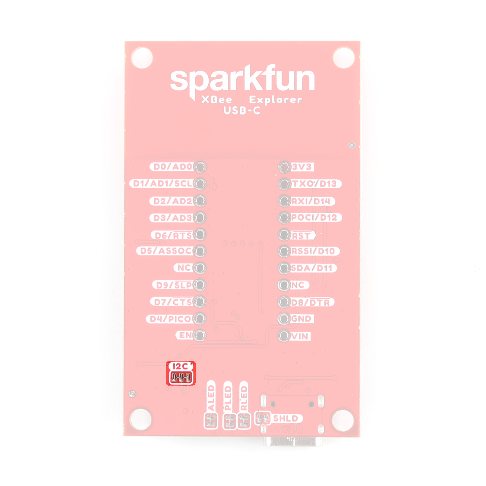
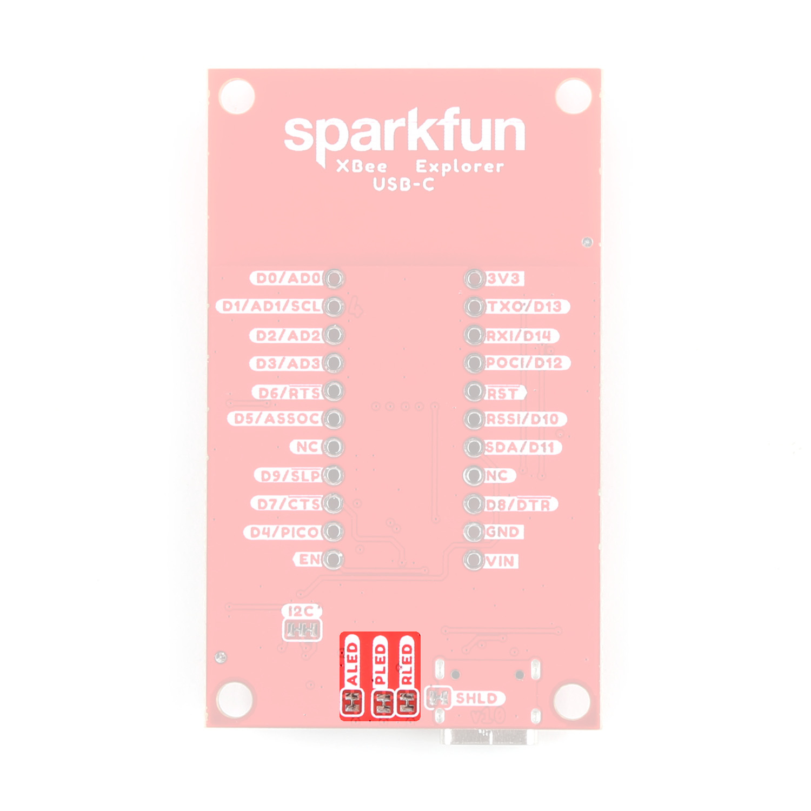
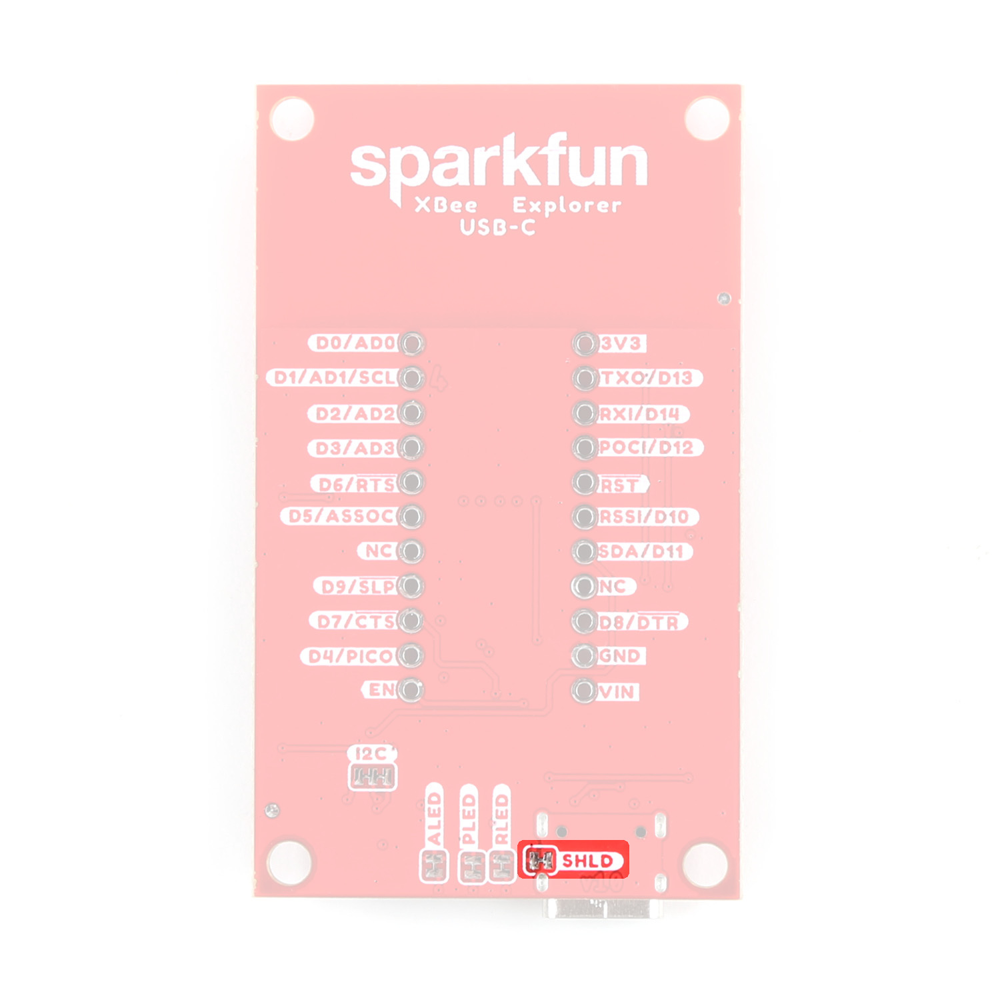

<!-- This section goes into detail about the various components on the product, solder jumpers as well as the board dimensions with a dimensional drawing exported from Eagle. -->

## XBee Smart Modem Socket

We've kept the XBee socket consistent with the XBee pinout, so this breakout board is backwards compatible. In order to take full advantage of this board, we recommend one of the newer Digi XBee boards. Either the [Digi XBee 3 Low-Power LTE-M/NB-IoT, GNSS, no SIM](https://www.sparkfun.com/products/22329) or the [Digi XBee 3 North America LTE Cat 1, 3G, GNSS, no SIM](https://www.sparkfun.com/products/22330). 

<figure markdown>
[{ width="400" }](assets/imgs/assets/img/22043-XBee-Explorer-USB-C-XBeeSocket.jpg "Click to enlarge")
<figcaption markdown>XBeeSocket</figcaption>
</figure>

## Power

The USB-C connector on the board is for UART. Input VCC range is between <b>3.3V-4.3V</b>. 

<figure markdown>
[{ width="400" }](assets/img/22043-XBee-Explorer-USB-C-USBC.jpg "Click to enlarge")
<figcaption markdown>USB-C</figcaption>
</figure>

## LEDs

There are three LEDs on the board: 

<figure markdown>
[{ width="400" }](assets/img/22043-XBee-Explorer-USB-C-LEDS.jpg "Click to enlarge")
<figcaption markdown>LEDs</figcaption>
</figure>

####PWR

This LED lights up when power is provided to the board. 

####ASC
This LED on the development board blinks when the XBee is registered to the cellular network.

<table class="tg" align="left">
  <tr>
    <th width="20%" align="center"><b>Blink</b></th>
    <th width="20%" align="center"><b>Timing</b></th>
    <th width="60%" align="left"><b>Meaning</b></th>
  </tr>
  <tr>
    <td align="center">On</td>
    <td align="center">Solid</td>
    <td>Not joined to a mobile network</td>
  </tr>
  <tr>
    <td align="center">Double blink</td>
    <td align="center">½ second</td>
    <td>The last TCP/UDP/SMS attempt failed. If the LED has this
pattern, you may need to check DI (Remote Manager
Indicator) or CI (Protocol/Connection Indication) for the cause
of the error.</td>
  </tr>
  <tr>
    <td align="center">Single blink</td>
    <td align="center">1 second</td>
    <td>Normal operation</td>
  </tr>
</table>

####RSSI 
This LED is the Received Signal Strength Indicator. When configured, it reflects the received signal strength.

RSSI PWM
The RSSI/PWM output is enabled continuously, unlike other XBee products where the output is enabled for a short period of time after each received transmission. If running on the XBIB development board, DIO10 is connected to the RSSI LEDs, which may be interpreted as follows:

<table class="tg" align="left">
  <tr>
    <th width="20%" align="center"><b>PWM duty cycle</b></th>
    <th width="20%" align="center"><b>Number of LEDs turned on</b></th>
    <th width="60%" align="left"><b>Received signal strength (dBm)</b></th>
  </tr>
  <tr>
    <td align="center">79.39% or more</td>
    <td align="center">3</td>
    <td>-83 dBm or higher</td>
  </tr>
  <tr>
    <td align="center">62.42% to 79.39%</td>
    <td align="center">2</td>
    <td align="left"> -93 to -83 dBm</td>
  </tr>
  <tr>
    <td align="center">45.45% to 62.42%</td>
    <td align="center">1</td>
    <td align="left">-103 to -93 dBm</td>
  </tr>
  <tr>
    <td align="center">Less than 45.45%</td>
    <td align="center">0</td>
    <td align="left">Less than -103 dBm, or no cellular network connection</td>
  </tr>
</table>

## GPIO

We've broken out the XBee pins to plated through holes on either side of the board. 

<figure markdown>
[{ width="400" }](assets/img/22043-XBee-Explorer-USB-C-GPIO-PTHs.jpg "Click to enlarge")
<figcaption markdown>GPIO</figcaption>
</figure>

## Jumpers

??? note "Never modified a jumper before?"
	Check out our <a href="https://learn.sparkfun.com/tutorials/664">Jumper Pads and PCB Traces tutorial</a> for a quick introduction!
	

		<a href="https://learn.sparkfun.com/tutorials/664">
		 
        How to Work with Jumper Pads and PCB Traces</a>
	

### I2C Jumper

<figure markdown>
[{ width="400" }](assets/img/22043-XBee-Explorer-USB-C-I2CJumpers.jpg "Click to enlarge")
<figcaption markdown>I2C Jumpers</figcaption>
</figure>

### LED Jumper

If power consumption is an issue (or if you just don't like the LEDs), cut the respective jumper to sever power to the LED. 

* PLED: Red
* ALED: Blue
* RSSI: Yellow

<figure markdown>
[{ width="400" }](assets/img/22043-XBee-Explorer-USB-C-LEDJumpers.jpg "Click to enlarge")
<figcaption markdown>LED Jumpers</figcaption>
</figure>

### Shield Jumper

For most applications, the single point grounding of the Direct USB or UART at the USB-C connector is sufficient. However, should you run into problems with EMI/EMC, we've provided a jumper that allows you to disconnect the connector from ground.

<figure markdown>
[{ width="400" }](assets/img/22043-XBee-Explorer-USB-C-ShieldJumper.jpg "Click to enlarge")
<figcaption markdown>Shield Jumper</figcaption>
</figure>

## Board Dimensions

The board dimensions are illustrated in the drawing below; the listed measurements are in inches.

<figure markdown>
[{ width="400" }](assets/board_files/SparkFun_XBee_Explorer_USB-C_BoardDimensions.png "Click to enlarge")
<figcaption markdown> Board Dimensions</figcaption>
</figure>

??? tip "Need more measurements?"
	For more information about the board's dimensions, users can download the [Eagle files](assets/board_files/SparkFun_XBee_Explorer_USB-C-EagleFiles.zip) for the board. These files can be opened in Eagle and additional measurements can be made with the dimensions tool.

	??? info ":octicons-download-16:{ .heart } Eagle - Free Download!"
		Eagle is a [CAD]("computer-aided design") program for electronics that is free to use for hobbyists and students. However, it does require an account registration to utilize the software.

		

		[Download from :autodesk-primary:{ .autodesk }](https://www.autodesk.com/products/eagle/free-download "Go to downloads page"){ .md-button .md-button--primary width="250px" }
		

	
	??? info ":straight_ruler: Dimensions Tool"
		This video from Autodesk demonstrates how to utilize the dimensions tool in Eagle, to include additional measurements:

		

		

		<iframe src="https://www.youtube.com/embed/dZLNd1FtNB8" title="EAGLE Dimension Tool" frameborder="0" allow="accelerometer; autoplay; clipboard-write; encrypted-media; gyroscope; picture-in-picture" allowfullscreen></iframe>
		

		
