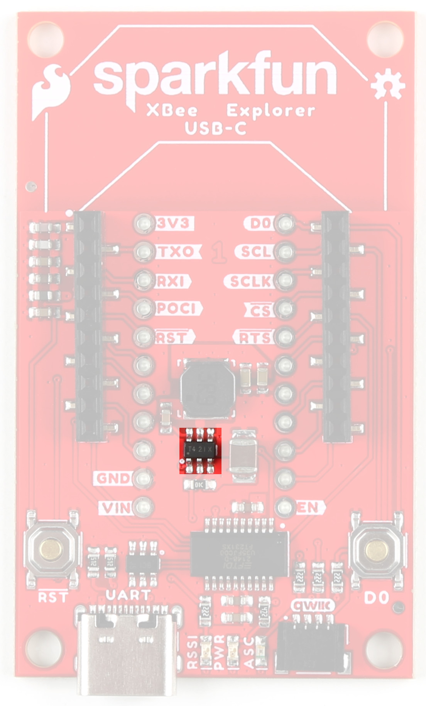

<!-- This section goes into detail about the various components on the product, solder jumpers as well as the board dimensions with a dimensional drawing exported from Eagle. -->

## Digi XBee Smart Modem Socket

We've kept the Digi XBee socket consistent with the Digi XBee pinout, so this breakout board is backwards compatible. In order to take full advantage of this board, we recommend one of the newer Digi XBee boards. The [Digi XBee 3 Low-Power LTE-M/NB-IoT, GNSS, no SIM](https://www.sparkfun.com/products/22329) is a great bet. 

<figure markdown>
[{ width="400" }](assets/imgs/assets/img/22043-SparkFun-XBee-Explorer-USB-C-XBeeSocket.jpg "Click to enlarge")
<figcaption markdown>XBeeSocket</figcaption>
</figure>

## Power

The USB-C connector on the board is for UART. Input VCC range is between <b>3.3V-4.3V</b>. 

<figure markdown>
[{ width="400" }](assets/img/22043-SparkFun-XBee-Explorer-USB-C-USBC.jpg "Click to enlarge")
<figcaption markdown>USB-C</figcaption>
</figure>

## Buck Converter - AP63203

The AP63203 Buck Converter ensures appropriate power supply to the components of the board. VIN range is 3.8V-5.5V. Output is 2A max.

<figure markdown>
[{ width="400" }](assets/img/22043-SparkFun-XBee-Explorer-USB-C-BuckConverter.jpg "Click to enlarge")
<figcaption markdown>AP63203 Buck Converter</figcaption>
</figure>

## USB to UART Bridge

The FT231XS translates data between your computer and the XBee. This is one of our favorite chips because it supports all computer platforms and it's easy to work with. If this is the first FTDI chip you've ever connected to your computer (it probably won't be your last), there is some driver installation to get out of the way. We've written a tutorial detailing [How to Install FTDI Drivers tutorial](tutorials/74).

<figure markdown>
[{ width="400" }](assets/img/22043-SparkFun-XBee-Explorer-USB-C-FT231XS.jpg "Click to enlarge")
<figcaption markdown>FT231XS USB to UART Bridge</figcaption>
</figure>

## Qwiic Connector

The Qwiic connector on the SparkFun Digi XBee® Explorer USB-C Board provides power and I2C connectivity to Qwiic breakout boards. Note that I2C functionality is not enabled by default. 

<figure markdown>
[{ width="400" }](assets/img/22043-SparkFun-XBee-Explorer-USB-C-QwiicConnex.jpg "Click to enlarge")
<figcaption markdown>Qwiic Connector</figcaption>
</figure>

## LEDs

There are a number of LEDs on the board: 

<figure markdown>
[{ width="400" }](assets/img/22043-SparkFun-XBee-Explorer-USB-C-LEDs.jpg "Click to enlarge")
<figcaption markdown>LEDs</figcaption>
</figure>

###PWR

This LED lights up when power is provided to the board. 

###ASC

This LED on the development board blinks when the Digi XBee is registered to the cellular network.

| Blink | Timing | Meaning |
| --- | --- | --------- |
| On | Solid | Not joined to a mobile network |
| Double Blink | ½ second | The last TCP/UDP/SMS attempt failed. If the LED has this pattern, you may need to check DI (Remote Manager Indicator) or CI (Protocol/Connection Indication) for the cause of the error. | 
| Single blink | 1 Second | Normal Operation |

###RSSI 

This LED is the Received Signal Strength Indicator. When configured, it reflects the received signal strength.

RSSI PWM
The RSSI/PWM output is enabled continuously, unlike other Digi XBee products where the output is enabled for a short period of time after each received transmission. If running on the XBIB development board, DIO10 is connected to the RSSI LEDs, which may be interpreted as follows:

| PWM duty cycle | Number of LEDs turned on | Received signal strength (dBm) |
| --- | --- | --------- |
| 79.39% or more | 3 | 83 dBm or higher |
| 62.42% to 79.39% | 2 | -93 to -83 dBm |
| 45.45% to 62.42% | 1 | -103 to -93 dBm |
| Less than 45.45% | 0 | Less than -103 dBm, or no cellular network connection |

## GPIO

We've broken out the Digi XBee pins to plated through holes on either side of the board. 

<figure markdown>
[{ width="400" }](assets/img/22043-SparkFun-XBee-Explorer-USB-C-GPIO.jpg "Click to enlarge")
<figcaption markdown>GPIO</figcaption>
</figure>

## Buttons

There are two buttons on the board - D0 and Reset. The Reset button allows the user to reset the running program; the D0 button is connected to GPIO to be used as the user sees fit. 

<figure markdown>
[{ width="400" }](assets/img/22043-SparkFun-XBee-Explorer-USB-C-Button.jpg "Click to enlarge")
<figcaption markdown>D0 and Reset Buttons</figcaption>
</figure>

## Jumpers

??? note "Never modified a jumper before?"
	Check out our <a href="https://learn.sparkfun.com/tutorials/664">Jumper Pads and PCB Traces tutorial</a> for a quick introduction!
	

		<a href="https://learn.sparkfun.com/tutorials/664">
		 
        How to Work with Jumper Pads and PCB Traces</a>
	

### I2C Jumper

The I2C jumper pulls the SDA and SCL pins to VDD (normally 3.3V) through two 2.2K Ohm resistors. If you have multiple Qwiic devices on the same bus you may want to disable these by opening the jumper (assuming they are also operating at 3.3V logic).

<figure markdown>
[{ width="400" }](assets/img/22043-SparkFun-XBee-Explorer-USB-C-I2CJumper.jpg "Click to enlarge")
<figcaption markdown>I2C Jumpers</figcaption>
</figure>

### LED Jumper

If power consumption is an issue (or if you just don't like the LEDs), cut the respective jumper to sever power to the LED. 

* PLED: Red
* ALED: Blue
* RSSI: Yellow

<figure markdown>
[{ width="400" }](assets/img/22043-SparkFun-XBee-Explorer-USB-C-LEDJumpers.jpg "Click to enlarge")
<figcaption markdown>LED Jumpers</figcaption>
</figure>

### Shield Jumper

For most applications, the single point grounding of the Direct USB or UART at the USB-C connector is sufficient. However, should you run into problems with EMI/EMC, we've provided a jumper that allows you to disconnect the connector from ground.

<figure markdown>
[{ width="400" }](assets/img/22043-SparkFun-XBee-Explorer-USB-C-ShieldJumpers.jpg "Click to enlarge")
<figcaption markdown>Shield Jumper</figcaption>
</figure>

## Board Dimensions

The SparkFun Digi XBee® Explorer USB-C Board dimensions are illustrated in the drawing below; the listed measurements are in inches.

<figure markdown>
[{ width="400" }](assets/board_files/22043_SparkFun_Digi_XBee_Explorer_USB-C_BoardOutline_Crop.png "Click to enlarge")
<figcaption markdown> Board Dimensions</figcaption>
</figure>

??? tip "Need more measurements?"
	For more information about the board's dimensions, users can download the [Eagle files](assets/board_files/22043_SparkFun_Digi_XBee_Explorer_USB-C_EagleFiles.zip) for the board. These files can be opened in Eagle and additional measurements can be made with the dimensions tool.

	??? info ":octicons-download-16:{ .heart } Eagle - Free Download!"
		Eagle is a [CAD]("computer-aided design") program for electronics that is free to use for hobbyists and students. However, it does require an account registration to utilize the software.

		

		[Download from :autodesk-primary:{ .autodesk }](https://www.autodesk.com/products/eagle/free-download "Go to downloads page"){ .md-button .md-button--primary width="250px" }
		

	
	??? info ":straight_ruler: Dimensions Tool"
		This video from Autodesk demonstrates how to utilize the dimensions tool in Eagle, to include additional measurements:

		

		

		<iframe src="https://www.youtube.com/embed/dZLNd1FtNB8" title="EAGLE Dimension Tool" frameborder="0" allow="accelerometer; autoplay; clipboard-write; encrypted-media; gyroscope; picture-in-picture" allowfullscreen></iframe>
		

		
